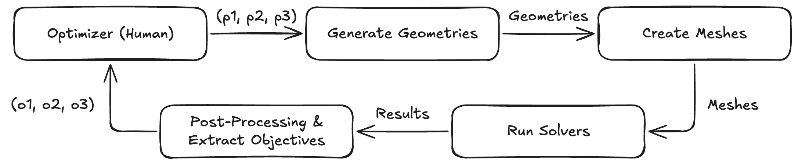
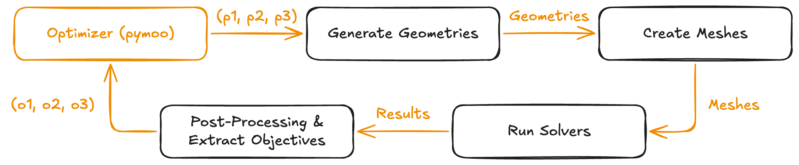
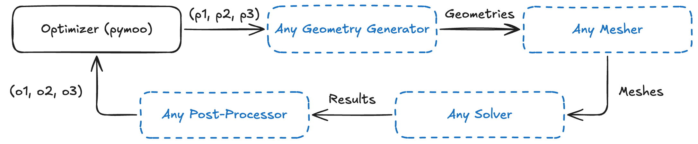
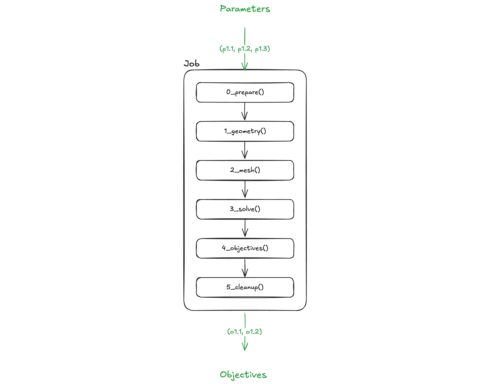
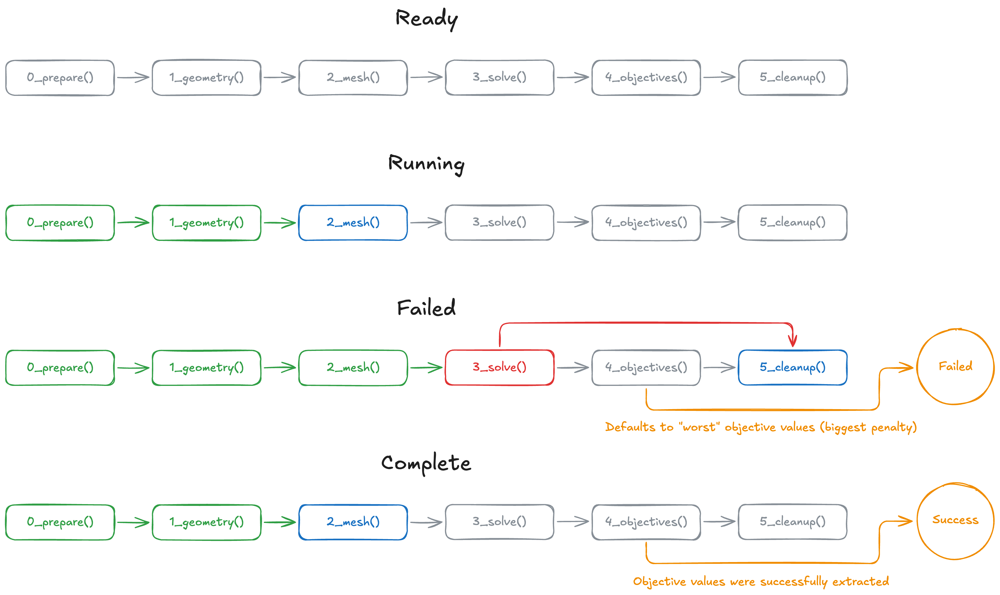
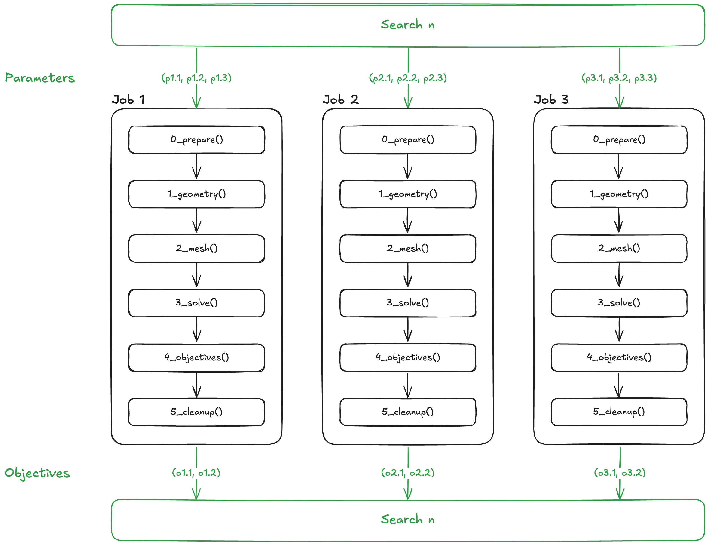
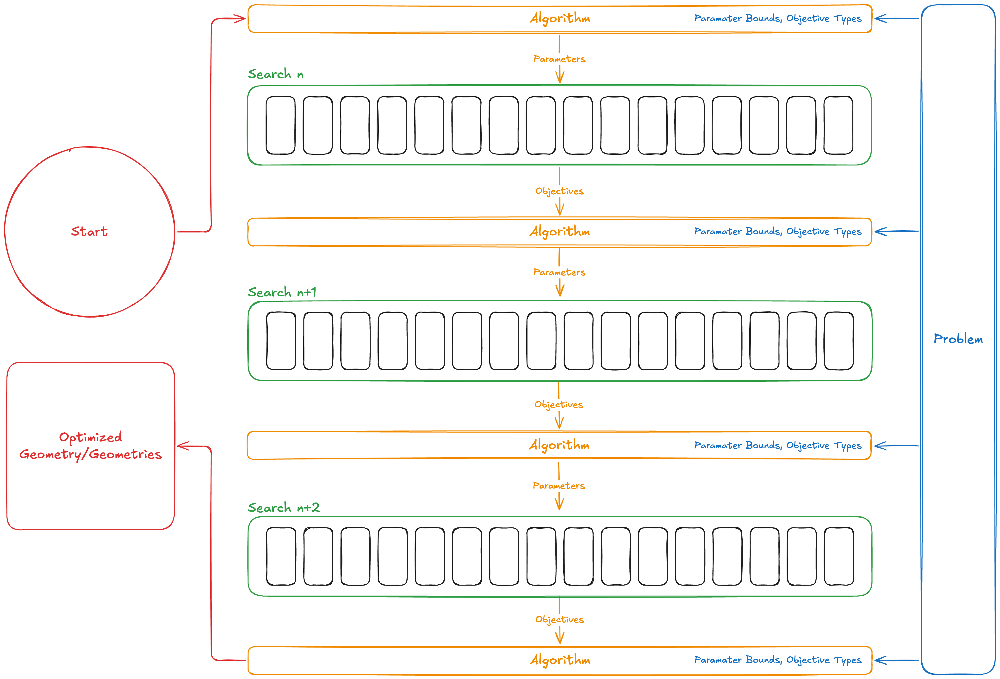
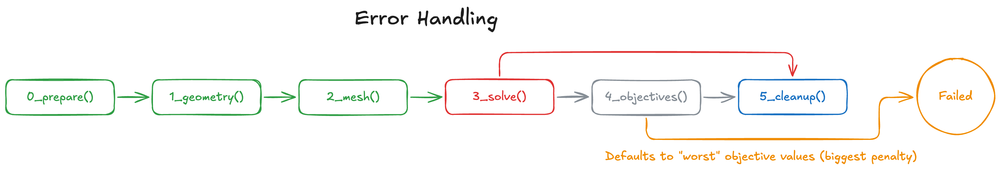
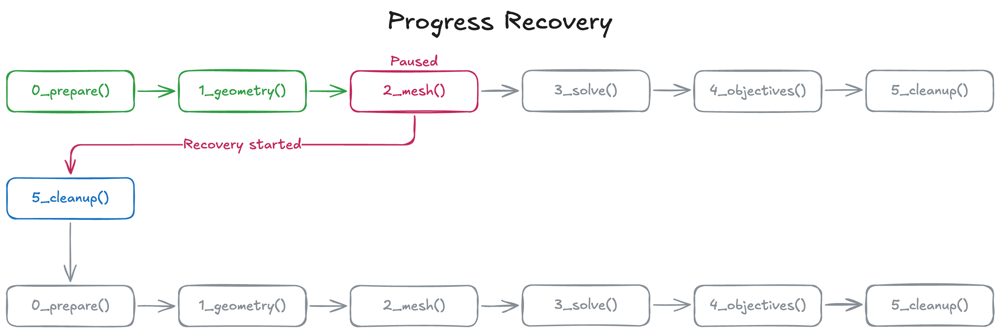

# OpenPFO

Add image...

The Open Parametric Flow Optimizer is an open-source design space exploration and optimization tool for computational fluid dynamics based design optimizations.

## Table of Contents

1. [Introduction](#introduction)
   1. [Computation Fluid Dynamics Optimization Lifecycle](#computation-fluid-dynamics-optimization-lifecycle)
   2. [What does OpenPFO do?](#what-does-openpfo-do)
   3. [What doesn't OpenPFO do?](#what-doesnt-openpfo-do)
2. [Concepts](#concepts)
   1. [Job](#job)
   2. [Search](#search)
   3. [Problem & Algorithm](#problem-and-algorithm)
3. [Getting Started](#getting-started)
   1. [Quickstart](#quickstart)
   2. [Python](#python)
   3. [Virtual Environment](#virtual-environment)
   4. [Dependencies](#dependencies)
      1. [Python](#python-1)
      2. [OpenVSP (Optional)](#openvsp-optional)
      3. [FreeCAD (Optional)](#freecad-optional)
   5. [Install](#install)
4. [Usage](#usage)
   1. [Overview](#overview)
   2. [Inputs](#inputs)
      1. [Case Template (OpenFOAM)](#case-template-openfoam)
      2. [Post-processing (ParaView)](#post-processing-paraview)
      3. [Geometry Model (FreeCAD/OpenVSP)](#geometry-model-freecadopenvsp)
   3. [Commands](#commands)
      1. [pfo hello](#pfo-hello)
      2. [pfo version](#pfo-version)
      3. [pfo resetOutput](#pfo-resetoutput)
      4. [pfo checkConfig](#pfo-checkconfig)
      5. [pfo checkPrepare](#pfo-checkprepare)
         - [Options](#options)
      6. [pfo checkGeometries](#pfo-checkgeometries)
         - [Options](#options-1)
      7. [pfo checkMeshes](#pfo-checkmeshes)
      8. [pfo checkSolver](#pfo-checksolver)
      9. [pfo checkObjectives](#pfo-checkobjectives)
      10. [pfo checkCleanup](#pfo-checkcleanup)
      11. [pfo checkRun](#pfo-checkrun)
      12. [pfo checkResults](#pfo-checkresults)
      13. [pfo checkOutput](#pfo-checkoutput)
      14. [pfo run](#pfo-run)
5. [Configuration](#configuration)
   1. [Compute Settings](#compute-settings)
      - [Example](#example)
      - [High Performance Computing (HPC) Flag](#high-performance-computing-hpc-flag)
      - [Processors per Job](#processors-per-job)
      - [Max Job Workers](#max-job-workers)
   2. [Design Parameters](#design-parameters)
      - [Example](#example-1)
      - [Name](#name)
      - [ID](#id)
      - [Minimum](#minimum)
      - [Maximum](#maximum)
   3. [Optimization Objectives](#optimization-objectives)
      - [Example](#example-2)
      - [Name](#name-1)
      - [ID](#id-1)
      - [Type](#type)
   4. [Job Step Functions](#job-step-functions)
      - [`0_prepare.py`](#0_preparepy)
      - [`1_geometry.py`](#1_geometrypy)
      - [`2_mesh.py`](#2_meshpy)
      - [`3_solve.py`](#3_solvepy)
      - [`4_objectives.py`](#4_objectivespy)
      - [`5_cleanup.py`](#5_cleanuppy)
      - [`A_optimizer.py`](#a_optimizerpy)
   5. [Error Handling](#error-handling)
      - [Automatic Exception Catching](#automatic-exception-catching)
      - [Job Step Function Validation](#job-step-function-validation)
      - [Default Penalty](#default-penalty)
   6. [Progress Recovery](#progress-recovery)
   7. [Notes on Local Usage](#notes-on-local-usage)
   8. [Notes on HPC Usage](#notes-on-hpc-usage)
6. [Outputs](#outputs)
   1. [Structured Output](#structured-output)
      1. [`results.json`](#resultsjson)
      2. [meta](#meta)
   2. [Unstructured Output](#unstructured-output)
      1. [Filesystem](#filesystem)
      2. [Logs](#logs)
7. [Plugins](#plugins)
   1. [Report](#report)
   2. [Asset Collection](#asset-collection)
   3. [Output Compression](#output-compression)
   4. [Surrogate Modeling](#surrogate-modeling)
8. [Examples](#examples)
9. [Acknowledgements](#acknowledgements)
   1. [Contributors](#contributors)
   2. [Advisors](#advisors)
   3. [Disclaimer](#disclaimer)
10. [Appendix](#appendix)
11. [Appendix A: Full `results.json` schema definition](#appendix-a-full-resultsjson-schema-definition)

## Introduction

OpenPFO is a collection of abstractions, tools, and plugins that help automate computational fluid dynamics (CFD) based design space exploration and optimization.

### Computation Fluid Dynamics Optimization Lifecycle



The CFD optimization lifecycle involves the optimizer, typically an engineer, to define the constraints of a design problem through the bounds of parameters in a geometry model.

The parameters are used to generate geometries, the geometries are used to generate meshes, the meshes are used to run the CFD solvers, and the results are used to extract performance objectives which are analyzed by the engineer who continues this optimization process.

Every intermediate step in this process is time-consuming, tedious, and error-prone.

### What does OpenPFO do?



OpenPFO attempts to simplify the CFD optimization lifecycle by reducing the amount of time-consuming, tedious, and error-prone steps by constructing abstractions, provide quality of life tools, and programmatically automating intermediate processes.

A programmatic implementation of optimization algorithms generate a set of parameter combinations to evaluate, the parameters are used to generate geometries through modeling software, the geometries are meshed using meshing software, the meshes are solved using solving software, the objectives are extracted from the solver results, and objectives are used by the optimization algorithm to continue this optimization process.

### What doesn't OpenPFO do?



OpenPFO was designed to be extensible with any geometry generator, any mesher, any solver, and any post-processor. Rather than providing opinionated abstractions over each of these steps, OpenPFO provides templates for [user-defined functions (UDF)](#job-step-functions) with opinionated parameters and return values.

Shown in blue above are user-defined functions. These functions provide the extensibiilty required for custom behaviour while providing the necessary robustness for reliable automation.

## Concepts

OpenPFO has four main abstractions that are used in the workflow.

### Job



A job is one sequence of the CFD process (geometry, mesh, solve, post-process) for one combination of design parameters.

Jobs can be in one of the following states:



### Search



A search is a collection of jobs that evaluate one set of parameter combinations.

### Problem & Algorithm



The problem provides the bounds of each design parameter as well as the objective types.

The algorithm is the programmatic implementation of the optimization algorithm and uses the objectives evaluated from each search iteration to generate new sets of parameter combinations to evaluate.

After the algorithm's termination criterion is reaches, a final set of solution(s) are provided.

## Getting Started

Quickstart instructions are provided below; however, if you prefer to set up the environment yourself, step-by-step instructions are provided in the subsequent sections.

### Quickstart

Quick setup scripts are provided in `scripts/`.

```shell
# Local
source scripts/init-local.sh

# High performance computing (HPC)
source scripts/init-hpc.sh
```

### Python

OpenPFO requires Python 3.11.

### Virtual Environment

To start using OpenPFO, create a virtual environment

```shell
# Python
python3 -m venv .venv

# Virtualenv
virtualenv .venv
```

Activate the virtual environment

```shell
source .venv/bin/activate
```

### Dependencies

OpenPFO only requires a handful of dependencies to operate. Some optional dependencies that may be required for the user-defined functions, installation steps for them are provided below.

#### Python

Install python dependencies

```shell
# Local
pip install -r requirements-local.txt

# HPC
pip install -r requirements-hpc.txt
```

#### OpenVSP (Optional)

Either download OpenVSP from the [official website](https://openvsp.org/download.php) or [build it from source](https://openvsp.org/wiki/doku.php?id=ubuntu_instructions).

> [!NOTE]
> Make sure you have loaded modules `gcc 14` and `swig` before building from source.
> Make sure the flag `-DVSP_USE_SYSTEM_GLEW=false` is set during buildlibs and flags
> `-DVSP_NO_VSPAERO=ON -DVSP_NO_GRAPHICS=ON -DVSP_NO_HELP=ON -DVSP_NO_DOC=ON` are set for build.

#### FreeCAD (Optional)

To be filled...

### Install

To start using OpenPFO, install the package in editable mode. This is important as OpenPFO is a framework, you implement your own user-defined functions.

```
pip install -e .
```

## Usage

To be filled...

### Overview

OpenPFO requires configuration in several locations.

1. `input/`: The input directory where any input files and directories are located.
2. `pfo/`: OpenPFO source directory and user-defined job step functions and the optimization algorithm.
   1. `0_prepare.py`: Job preparation user-defined step function.
   2. `1_geometry.py`: Job geometry generation user-defined step function.
   3. `2_mesh.py`: Job mesh generation user-defined step function.
   4. `3_solve.py`: Job solving user-defined step function.
   5. `4_objectives.py`: Job objective extraction user-defined step function.
   6. `5_cleanup.py`: Job cleanup user-defined step function.
   7. `A_optimizer.py`: Configure optimization step algorithm.
3. `config.toml`: OpenPFO configuration.

### Inputs

Inputs for the optimization can be placed anywhere; however, for tidiness, it is best to place them inside the `input/` directory. OpenPFO does not provide special mechanisms for inputs, you bring your own data and operate on it as you wish. Some examples are provided below.

#### Case Template (OpenFOAM)

If you are running OpenPFO with OpenFOAM as the solver and/or mesher, it is generally a good idea to keep a case template in the `input/` directory. For example, `input/case_template/`. The case template is a single template that all points in the design space can inherit. This means your template mesh and solver settings should be compatible with all points in the design space.

> [!NOTE]
> This is not a strict requirement. OpenPFO will run reasonably well as long as your template mesh and solver settings are compatible with _most_ points in the design space. Localized errors in the design space are simply avoided by the optimization algorithm through infinite objective values and user-defined constraint violations.

#### Post-processing (ParaView)

During optimizations, you typically want to extract extra information from each point in your design space before cleaning up all the data. Using ParaView, macro python functions can be placed inside the `input/` directory. For example, `input/paraview/`. ParaView macro python functions can be ran through the command-line in batch mode, requiring no GUI for rendering, a common solution used in HPC platforms.

#### Geometry Model (FreeCAD/OpenVSP)

An optimization typically involves the exploration of the design space of a paramaterized geometry model. A model is unique in that they produce non-parameterized geometry outputs such as STL, OBJ, STEP, etc. Geometry models can be placed inside the `input/` directory. For example, `input/model.vsp3` or `input/model.FCStd`.

### Commands

OpenPFO comes with a collection of commands to help set up, test, and run your optimizations. Every command comes with a `--help` flag.

#### `pfo hello`

Say hello to OpenPFO.

#### `pfo version`

Get the version of OpenPFO.

#### `pfo resetOutput`

Deletes the output directory `output/`.

> [!WARNING]
> Make sure you save any important your work before running this command.

#### `pfo checkConfig`

Checks the validity of the configuration file `config.toml` against the schema.

#### `pfo checkPrepare`

Checks the preparation job step function `0_prepare.py`.

##### Options

| Option  | Type    | Description                                       |
| ------- | ------- | ------------------------------------------------- |
| count   | Integer | The number of points to generate                  |
| random  | Boolean | Whether to randomize the points or linearize them |
| cleanup | Boolean | Whether to run the cleanup step                   |

#### `pfo checkGeometries`

Checks the geometry generation job step function `1_geometry.py`.

##### Options

| Option    | Type    | Description                                                                                                                                                          |
| --------- | ------- | -------------------------------------------------------------------------------------------------------------------------------------------------------------------- |
| count     | Integer | The number of points to generate                                                                                                                                     |
| random    | Boolean | Whether to randomize the points or linearize them                                                                                                                    |
| visualize | Boolean | Whether to visualize the geometries using `pyvista` (HPC mode must be disabled and a `visualize_filepath` must be returned in the `1_geometry.py` job step function) |
| cleanup   | Boolean | Whether to run the cleanup step                                                                                                                                      |

#### `pfo checkMeshes`

Checks the mesh generation job step function `2_mesh.py`.

| Option  | Type    | Description                                       |
| ------- | ------- | ------------------------------------------------- |
| count   | Integer | The number of points to generate                  |
| random  | Boolean | Whether to randomize the points or linearize them |
| cleanup | Boolean | Whether to run the cleanup step                   |

#### `pfo checkSolver`

Checks the solving job step function `3_solve.py`.

| Option  | Type    | Description                                       |
| ------- | ------- | ------------------------------------------------- |
| count   | Integer | The number of points to generate                  |
| random  | Boolean | Whether to randomize the points or linearize them |
| cleanup | Boolean | Whether to run the cleanup step                   |

#### `pfo checkObjectives`

Checks the objective extraction job step function `4_objectives.py`.

> [!NOTE]
> This command always retrieves existing outputs inside `output/` and executes the `4_objectives.py` job step function on them.

#### `pfo checkCleanup`

Checks the cleanup job step function `5_cleanup.py`.

> [!NOTE]
> This command always retrieves existing outputs inside `output/` and executes the `5_cleanup.py` job step function on them.

#### `pfo checkRun`

Checks all job step functions as though they would run in the optimizer.

| Option     | Type    | Description                                       |
| ---------- | ------- | ------------------------------------------------- |
| count      | Integer | The number of points to generate                  |
| random     | Boolean | Whether to randomize the points or linearize them |
| objectives | Boolean | Whether to run the objectives step                |
| cleanup    | Boolean | Whether to run the cleanup step                   |
| resume     | Boolean | Resume progress from an existing run              |

#### `pfo checkResults`

Checks the validity of the `results.json` file against a schema.

#### `pfo checkOutput`

Checks and warns the presence of the `output` directory.

> [!NOTE]
> This check function is ran before any workflows begin to ensure a user does not accidentally overwrite their existing outputs.

#### `pfo run`

Runs the optimizer using the optimization algorithm defined in `A_optimizer.py`, the configuration defined in `config.toml` and all user-defined job step functions defined in `pfo/`.

| Option  | Type    | Description                          |
| ------- | ------- | ------------------------------------ |
| cleanup | Boolean | Whether to run the cleanup step      |
| resume  | Boolean | Resume progress from an existing run |

### Configuration

OpenPFO's optimiztaion configuration can be found in `config.toml`. The configuration file is a separate file dedicated to user-defined configuration of the compute settings, design parameters, and optimization objectives.

#### Compute Settings

OpenPFO can run both locally and on an HPC platform.

##### Example

```toml
[compute]
hpc=true
processors_per_job=64
max_job_workers=15
```

##### High Performance Computing (HPC) Flag

Due to the more restrictive nature of command-line interfaces of most HPC platforms, a flag is provided to turn OpenPFO GUI features off.

```toml
# Turn off GUI features
hpc=true

# Turn on GUI features
hpc=false
```

##### Processors per Job

Most meshers and solvers support parallel processing. OpenPFO provides this shared-variable across all user-defined job step functions to support an equal number of processors across all running jobs.

```toml
# Single processor for each job
processors_per_job=1

# 64 processors for each job
processors_per_job=64
```

##### Max Job Workers

OpenPFO supports job parallelization across each search iteration. This means jobs are placed in a queue and a thread pool executor executes them as thread workers become available. This is useful if you are running OpenPFO on an HPC platform where compute resources are ubiquitous.

```toml
# Sequential jobs
max_job_workers=1

# 15 parallel jobs
max_job_workers=15
```

> [!NOTE]
> Efficient scheduling with job parallelization typically requires a carefully planned optimization plan. For example, when using genetic optimization algorithms, it is recommended to use a population size that is divisible by the `max_job_workers`.

#### Design Parameters

Design parameters construct the design space. Each design parameter is defined in a toml array entry.

##### Example

```toml
[model]
[[model.parameters]]
name="Angle of Attack"
id="AESEYMMNJRI:WingGeom:XForm:Y_Rel_Rotation"
min=-2
max=10
[[model.parameters]]
name="Sweep"
id="DFMNISRTXAJ:WingGeom:XSec_1:Sweep"
min=10
max=33
```

##### Name

A user-friendly name for the parameter. OpenPFO does not use this field for computation.

##### ID

An identifier for the parameter, this value is provided for each `Variable` object instance inside each `Point` object instance. The identifier can be used to mutate a parameter inside the geometry model.

##### Minimum

The minimum bound of the design parameter.

##### Maximum

The maximum bound of the design parameter.

#### Optimization Objectives

Objectives are the metrics that are used to evaluate the fitness of each point in the design space. Each objective is defined in a toml array entry.

##### Example

```toml
[optimizer]
[[optimizer.objectives]]
name="Cl"
id="cl"
type="maximize"
[[optimizer.objectives]]
name="Volume"
id="volume"
type="minimize"
```

##### Name

A user-friendly name for the objective. OpenPFO does not use this field for computation.

##### ID

An identifier for the objective, this value can be used to retrive and populate the correct `Objective` object instance inside the `pfo/4_objectives.py` step function.

##### Type

Whether the goal is to minimize or maximize this objective.

```toml
# Minimization
type="minimize"

# Maximization
type="maximize"
```

> [!NOTE]
> The optimization algorithm will use this value to determine whether the optimization should negate the objective value before evaluating the _next_ search iteration.
> Since pymoo will only minimize objectives, maximization objective values will be negated.
> Likewise, failed jobs will default to use the system's smallest or largest possible floating-point value to signal poor fitness of the point in the design space.

### Job Step Functions

Job step functions are user-defined functions that facilitate the automated execution of each step in the CFD lifecycle. Job step functions are prefixed with numbers to emphasize the order of execution of each step function. All job step functions are defined under the `pfo/` directory.

Templates of each job step function can be found in the `.OpenPFO/` directory.

#### `0_prepare.py`

The preparation function allows you to programmatically set up the files and directories required for each job.

For example, when using OpenFOAM, the case template is cloned from the `input/` directory into the job's output directory. Subdomain decomposition and post-processing set up inside the `controlDict` are also programmatically done here.

```python
# classes
from classes.functions import PrepareParameters, PrepareReturn


def prepare(prepare_parameters: PrepareParameters):
    """
    This function is used to prepare each job.
    """

    job_directory = prepare_parameters.job_directory
    processors_per_job = prepare_parameters.processors_per_job
    job_id = prepare_parameters.job_id
    logger = prepare_parameters.logger
    point = prepare_parameters.point
    meta = prepare_parameters.meta

    """ ======================= YOUR CODE BELOW HERE ======================= """

    PREPARE_RETURN = PrepareReturn()

    """ ======================= YOUR CODE ABOVE HERE ======================= """

    return PREPARE_RETURN
```

#### `1_geometry.py`

The geometry generation function allows you to programmatically generate the job's geometry by using the design point provided by the function's parameters.

For example, when using OpenVSP, a model is called using the `vspscript` cli utility and a programmatically generated OpenVSP script and design variables file and then saved in the job's output directory.

```python
# classes
from classes.functions import GeometryParameters, GeometryReturn


def geometry(
    geometry_parameters: GeometryParameters,
) -> GeometryReturn:
    """
    This function is used to generate the geometry for each point in the design space.
    """

    job_directory = geometry_parameters.job_directory
    processors_per_job = geometry_parameters.processors_per_job
    job_id = geometry_parameters.job_id
    logger = geometry_parameters.logger
    point = geometry_parameters.point
    meta = geometry_parameters.meta

    """ ======================= YOUR CODE BELOW HERE ======================= """

    GEOMETRY_RETURN = GeometryReturn()

    """ ======================= YOUR CODE ABOVE HERE ======================= """

    return GEOMETRY_RETURN
```

#### `2_mesh.py`

The mesh generation function allows you to programmatically generate the job's mesh by using the geometry saved from the geometry generation function.

For example, when using `cfMesh` in OpenFOAM, the `meshDict` file cloned from the case template is read, the boundary offsets from the geometry are defined, surface features are extracted, and the final mesh is generated.

```python
# classes
from classes.functions import MeshParameters, MeshReturn


def mesh(
    mesh_parameters: MeshParameters,
):
    """
    The function is used to generate a mesh for each point in the design space.
    """

    job_directory = mesh_parameters.job_directory
    processors_per_job = mesh_parameters.processors_per_job
    logger = mesh_parameters.logger
    job_id = mesh_parameters.job_id
    point = mesh_parameters.point
    meta = mesh_parameters.meta

    """ ======================= YOUR CODE BELOW HERE ======================= """

    MESH_RETURN = MeshReturn()

    """ ======================= YOUR CODE ABOVE HERE ======================= """

    return MESH_RETURN
```

#### `3_solve.py`

The solving function allows you to programmatically solve the mesh generated from the mesh generation function.

For example, when using `simpleFoam` in OpenFOAM, all required dictionary files are read from the cloned case template and the solver is executed via commands.

```python
# classes
from classes.functions import SolveParameters, SolveReturn


def solve(
    solve_parameters: SolveParameters,
):
    """
    This function is used to solve the mesh for each point in the design space.
    """

    job_directory = solve_parameters.job_directory
    processors_per_job = solve_parameters.processors_per_job
    job_id = solve_parameters.job_id
    logger = solve_parameters.logger
    point = solve_parameters.point
    meta = solve_parameters.meta

    """ ======================= YOUR CODE BELOW HERE ======================= """

    SOLVE_RETURN = SolveReturn()

    """ ======================= YOUR CODE ABOVE HERE ======================= """

    return SOLVE_RETURN
```

#### `4_objectives.py`

The objective extraction function allows you to programmatically extract objectives from a successful CFD simulation.

For example, when using `fluidfoam` to read the output force coefficient files, the data file is read, the objectives are found and set in the corresponding `Objective` object instances, and the final objectives list is returned.

ParaView and other extraneous data extract logic can also be defined here.

```python
# classes
from classes.functions import ObjectivesParameters, ObjectivesReturn
from classes.objective import Objective


def objectives(
    objectives_parameters: ObjectivesParameters,
) -> ObjectivesReturn:
    """
    This function is used to extract objectives and export data for each job.

    NOTE: This function MUST modify the original list of objectives and return it.
    """

    def get_objective_by_id(objectives: list[Objective], id: str):
        return next((o for o in objectives if o.get_id() == id), None)

    job_directory = objectives_parameters.job_directory
    processors_per_job = objectives_parameters.processors_per_job
    objectives = objectives_parameters.objectives
    job_id = objectives_parameters.job_id
    logger = objectives_parameters.logger
    point = objectives_parameters.point
    meta = objectives_parameters.meta

    """ ======================= YOUR CODE BELOW HERE ======================= """

    OBJECTIVES_RETURN = ObjectivesReturn(objectives=objectives)

    """ ======================= YOUR CODE ABOVE HERE ======================= """

    return OBJECTIVES_RETURN
```

#### `5_cleanup.py`

The cleanup function allows you to programmatically remove all CFD artifacts generated from the prior job steps. This is useful for storage limited machines which cannot persist large artifacts after each CFD run.

For example, when using OpenFOAM, a large quantity of files and files with large sizes are generated to the degree of hundreds of gigabytes, most personal and HPC platforms simply do not have that much space for each user, let alone for multiple jobs being run in parallel.

```python
# classes
from classes.functions import CleanupParameters, CleanupReturn


def cleanup(
    cleanup_parameters: CleanupParameters,
):
    """
    This function is used to clean up artifacts after each job.
    """
    job_directory = cleanup_parameters.job_directory
    processors_per_job = cleanup_parameters.processors_per_job
    logger = cleanup_parameters.logger
    job_id = cleanup_parameters.job_id
    point = cleanup_parameters.point
    meta = cleanup_parameters.meta

    """ ======================= YOUR CODE BELOW HERE ======================= """

    CLEANUP_RETURN = CleanupReturn()

    """ ======================= YOUR CODE ABOVE HERE ======================= """

    return CLEANUP_RETURN
```

#### `A_optimizer.py`

The optimization algorithm function allows you to define the `pymoo` optimization algorithm, termination criteria, reproducibility, etc.

```python
# typing
from typing import Any

# pymoo
from pymoo.algorithms.moo.nsga2 import NSGA2


def optimizer(problem: Any):
    """
    This function is used to define the `pymoo` optimiztion algorithm.
    """
    algorithm = None

    """ ======================= YOUR CODE BELOW HERE ======================= """

    """ ======================= YOUR CODE ABOVE HERE ======================= """

    return algorithm
```

#### Error Handling



Errors happen during automated workflow runs for a variety of reasons.

- The user-defined functions contain bugs.
- The geometry fails to generate.
- The mesh fails to generate.
- The solver encounters numerical instabilities.
- The objectives fail to be extracted.
- Etc.

Regardless, errors should be expected and gracefully handled in order for the workflow to run end-to-end with no user intervention unless they are desired (pausing the workflow).

OpenPFO handles errors using two methods: automatic exception catching and job step function validation.

##### Automatic Exception Catching


Every job step function catches all exceptions at the job class implementation (using `try ... except`) so the error handling logic is hidden from the user. Should a job step encounter a runtime exception, errors all future job step functions are skipped and the job immedietly executes the cleanup step before terminating.

##### Job Step Function Validation

Sometimes, a successful execution of an external tool may not always signal correct job artifact outputs. For example, the `cfMesh` mesher executing successfully may not always indicate that the output mesh's quality is satisfactory. Another example is when the solver successfully executes but does not complete the full timespan for the required residuals.

In such cases, user-defined functions should allow for user-defined validation mechanisms to ensure the artifacts of the job step are satisfactory, in other words, whether or not an error occured during the execution of the job steps.

OpenPFO provides validation capabilities through the return value constructor of user-defined job step functions. An example implementation of validation logic for the OpenFOAM solver is provided below.

```python
run_ok = True
if not os.path.isdir(f"{job_directory}/40"):
   run_ok = False

SOLVE_RETURN = SolveReturn(run_ok=run_ok)

""" ======================= YOUR CODE ABOVE HERE ======================= """

return SOLVE_RETURN
```

##### Default Penalty

Whether each job successfully evaluates or not, this information must be propagated back up to the optimizer. While successful jobs will contain objective values, failed jobs will have empty values. To ensure the optimizer has the required evaluations to iterate through the optimization automatically, OpenPFO utilizes default penalties.

All jobs are defaulted to maximum penalty unless the `4_objectives.py` user-defined function adds an objective value to each corresponding objective. When objective values are empty, the maximum penalty values are provided to the optimizer dependingo on the type of each objective.

- A minimization objective will have a default penalty of the largest possible floating-point value on the execution machine.
- A maximization objective will have a default penalty of the smallest possible floating-point value on the execution machine.

### Progress Recovery



Often times, optimization runs may need to be paused due to context switches or due to running out of allocated SLURM time in an HPC environment. In such cases, it is a necessity that the workflow continues progress from where it left off.

OpenPFO achieves progress recovery by reading the state of the workflow from the output `results.json`. **Given that the optimization algorithm is deterministic**, OpenPFO will pick up the evaluated objectives from previously ran jobs and reproduce the state from where the process was killed.

Once progress is successfully recovered, jobs that were previously running are first cleaned up, and then restarted from the first step, not the last successful step. This design choice is intentional.

For example, if the workflow is paused while a job was mid-execution in the solving step, there is not enough granularity in the saved progress data to know at what point in time to resume solving. It is much easier to cleanup all job artifacts and start again from the first step.

> [!WARNING]
> Progress recovery **requires** a reproducible optimization algorithm. If you are using `pymoo` algorithms, the `seed` argument must be deterministic. If you are implementing your own `pymoo` algorithm, you must ensure your algorithm is deterministic.

### Notes on Local Usage

Due to the compute-heavy nature of many geometry modelers, meshers and solvers, it is recommended to have ample compute capacity when using OpenPFO on personal devices.

### Notes on HPC Usage

If you are using `simple-slurm`, make sure your `SQUEUE_FORMAT` environment variable is valid. If you are unsure about its validity, `simple-slurm` will raise an error. You can also set the variable to `"%i","%j","%t","%M","%L","%D","%C","%m","%b","%R"`, `simple-slurm`'s default value.

While OpenPFO with job parallelization allows for jobs to be executed when workers are available, SLURM jobs utilize their own queue for job execution based on a multi-level priority queue. As such, OpenPFO cannot guarantee similar job runtimes when it is being run in SLURM.

HPC platforms typically do not come with a GUI. As such, it is up to the user to ensure the tools being called for each user-defined function only call UI-less software tools.

## Outputs

OpenPFO outputs are split into two areas: structured and unstructured outputs.

OpenPFO's output directory is structured like the following:

```
output/
   [job-id]/
   results.json
```

### Structured Output

Structured outputs are data that is programmatically processable in a deterministic manner.

#### `results.json`

OpenPFO outputs workflow progress through the `results.json` file. A rough schema is provided below. A full schema is defined in [Appendix A](#appendix-a-full-resultsjson-schema-definition).

```typescript
type Result = {
  config: Config;
  workflow: {
    jobs: Job[];
    searches: Search[];
  };
  solutions: Solution[];
  startTime: string;
  endTime: string;
  command: string;
};
```

#### `meta`

OpenPFO provides users the ability to add job metadata thorough a loose schema under the job schema.

```typescript
type Job = {
  id: string;
  searchId: string;
  status: "ready" | "running" | "failed" | "complete";
  runOk: boolean;
  steps: Step[];
  startTime: string;
  endTime: string;
  jobDirectory: string;
  point: Point;
  objectives: Objective[];
  meta: Record<string, any>;
};
```

Metadata can be added using the `meta` parameter in each job step function.

```python
# add metadata
meta.add_meta("geometry-top-view", "geometry-top-view.png")
meta.add_meta("computed-root-chord", 123)

# retrieve metadata
meta.get_meta("geometry-top-view")
meta.add_meta("computed-root-chord")
```

### Unstructured Output

Unstructured outputs are not deterministic and usually not programmatically accessible.

#### Filesystem

OpenPFO outputs job artifacts and job assets into each job's job output directory. Each job's directory lives under the root output directory, `output/` as a named directory of the job ID, `output/[Job ID]/`.

Users can save unstructured outputs such as ParaView screenshots, model standard files, OpenFOAM binned data, etc.

```
output/
   search-0-job-0/
      geometry-top-view.png
      search-0-job-0.stl
      search-0-job-0.vsp3
      postProcessing/
         binField1/
            0/
               forceBin.dat
   search-0-job-1/
      ...
```

#### Logs

Every OpenPFO command outputs all runtime logs in `OpenPFO.log`.

## Plugins

OpenPFO comes with plugins to support enhanced optimization and results visualization.

### Report

The OpenPFO report plugin is a tool to help visualize the progress and/or results of the optimiztaion.

To be filled...

### Asset Collection

To be filled...

### Output Compression

To be filled...

### Surrogate Modeling

To be filled...

## Examples

To be filled...

## Acknowledgements

This project was made possible through the Faculty of Engineering at the University of Waterloo.

### Contributors

- [Thomas Kim](https://www.linkedin.com/in/thomasjuhoonkim) - [thomasjuhoonkim](https://github.com/thomasjuhoonkim) - [thomas.kim@uwaterloo.ca](mailto:thomas.kim@uwaterloo.ca)
- [Kate Armstrong](https://www.linkedin.com/in/katelarmstrong/) - [katelarmstrong](https://github.com/katelarmstrong) - [k24armstrong@uwaterloo.ca](mailto:k24armstrong@uwaterloo.ca)
- [Emma Keeping](https://www.linkedin.com/in/emmaleekeeping/) - [emmaleekeeping](https://github.com/emmaleekeeping) - [ekeeping@uwaterloo.ca](mailto:ekeeping@uwaterloo.ca)

### Advisors

- [Dr. Jean-Pierre Hickey](https://uwaterloo.ca/mechanical-mechatronics-engineering/profile/j6hickey)
- [Dr. Jimmy-John Hoste](https://www.linkedin.com/in/jimmy-john-hoste-17278644/)

### Disclaimer

OpenPFO is part of the University of Waterloo's engineering capstone project courses. Future maintenence of this repository is subject to contributor availability. Contributors are welcome, please reach out to project owners regarding contributing.

---

## Appendix

### Appendix A: Full `results.json` schema definition

```typescript
type Parameter = {
  name: string;
  id: string;
  min: string;
  max: string;
};

type Objective = {
  name: string;
  id: string;
  type: "minimize" | "maximize";
  value?: number;
};

type Config = {
  compute: {
    hpc: boolean;
    processors_per_job: number;
    max_job_workers: number;
  };
  model: {
    parameters: Parameter[];
  };
  optimizer: {
    objectives: Objective[];
  };
};

type Variable = {
  name: string;
  id: string;
  value: string;
};

type Point = {
  representation: string;
  variables: Variable[];
};

type Job = {
  id: string;
  searchId: string;
  status: "ready" | "running" | "failed" | "complete";
  runOk: boolean;
  steps: Step[];
  startTime: string;
  endTime: string;
  jobDirectory: string;
  point: Point;
  objectives: Objective[];
  meta: Record<string, any>;
};

type Search = {
  id: string;
  jobs: string[];
  points: Point[];
};

type Solution = {
  point: Point;
  objectives: Objective[];
};

type Result = {
  config: Config;
  workflow: {
    jobs: Job[];
    searches: Search[];
  };
  solutions: Solution[];
  startTime: string;
  endTime: string;
  command: string;
};
```
