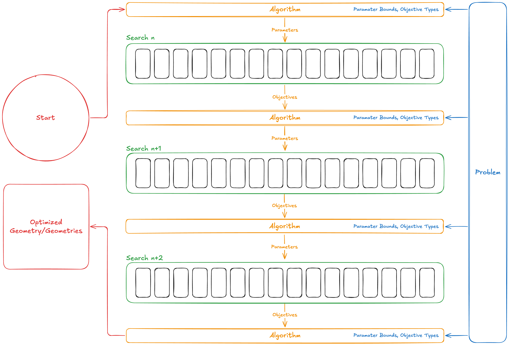
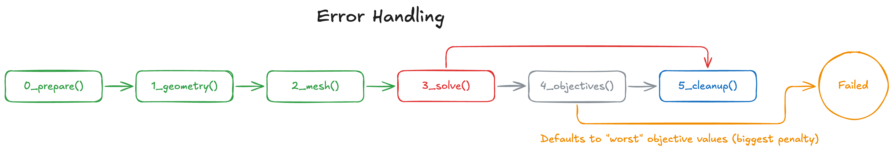
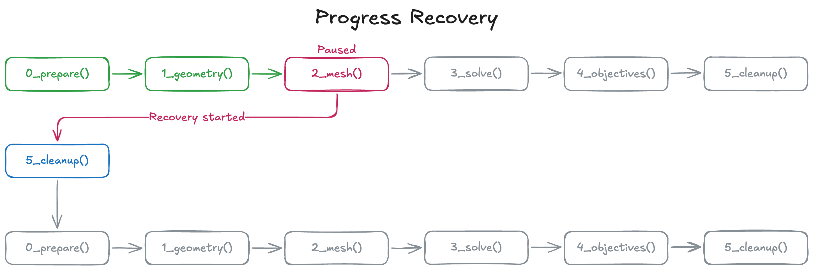

# Summary

Engineering design relies more and more on Computational Fluid Dynamics (CFD) as a means of validating and improving designs. This process involves four major steps: geometry generation, meshing, solving, and post-processing. Conducting design optimization using CFD requires repetition of most or all of these steps.

`OpenPFO` (Open Parametric Flow Optimizer) is an python workflow that integrates these four steps, with the pymoo optimization library [@pymoo]. The workflow can integrate any combination of open source software for each step such as `FreeCAD` [@FreeCAD], `OpenVSP` [@mcdonald2015interactive], OpenFOAM [@weller1998tensorial], and Paraview [@AhrensGL05]. The final product is one which is capable of accepting parameter ranges, optimization objectives, a parameterized geometry model, and a simulation case, iterating through the design space to provide optimized results.

# Statement of need

`OpenPFO` is a Python workflow to conduct CFD based design space exploration and optimization. The workflow interconnects the four main steps of CFD analysis: geometry generation, meshing, solving, and post processing, with an optimization algorithm. The purpose of the workflow is to streamline and automate the CFD-informed design optimization process.

This workflow replaces a heavily manual process where a design engineer has to manually iterate through the CFD process for many different design variations: creating the geometry, meshing the geometry, running the solver, and post-processing results, for each variation. This approach can be very time consuming and is a major barrier to CFD-based design optimization. `OpenPFO` streamlines this process by eliminating the repetitve steps and guesswork in the typical process, allowing engineers to focus on exploring and optimizing a wider design space.

# State of the field

There are a few tools which complete the goal of `OpenPFO`: SIEMENS HEEDS, Luminary Cloud, and nTop.

While each of these tools accomplish some or all of the goals of `OpenPFO`, each have at least one of two notable challenges, cost, and extensibility. `OpenPFO`, through its integration with open source resources, is free to use, which overcomes the cost barrier of existing tools. `OpenPFO` is also extensible, supporting integration with any external tool that comes with a programmatic interface. Specialized software such as `OpenVSP` or `OpenFOAM` have been implemented

# Software design



`OpenPFO` is an opinionated workflow designed for CFD-based design space exploration and optimization. Four main abstractions are provided: (1) Jobs, (2) Searches, (3) Problem, (4) Algorithm.

Each "Job" represents one combination of parameters, otherwise known as a geometry variation. Jobs implement 6 different user-defined functions called steps: `1_prepare`, `2_geometry`, `3_mesh`, `4_solve`, `5_objectives`, `cleanup`. Each step allows the user to programmatically define their automated steps, performing computations, interfacing with external tools, or submitting batch jobs to a scheduler.



Jobs handle exceptions for the user, preventing errors from interupting the workflow. Users may define programmatic step validation, allowing the job to be terminated early should there be validation errors.



Each user-defined function has explicit comments indicating where a user's programmatic logic should be placed.

```python
# classes
from classes.functions import GeometryParameters, GeometryReturn


def geometry(
    geometry_parameters: GeometryParameters,
) -> GeometryReturn:
    """
    This function is used to generate the geometry for each point in the design space.
    """

    job_directory = geometry_parameters.job_directory
    processors_per_job = geometry_parameters.processors_per_job
    job_id = geometry_parameters.job_id
    logger = geometry_parameters.logger
    point = geometry_parameters.point
    meta = geometry_parameters.meta

    """ ======================= YOUR CODE BELOW HERE ======================= """

    GEOMETRY_RETURN = GeometryReturn(run_ok=True)

    """ ======================= YOUR CODE ABOVE HERE ======================= """

    return GEOMETRY_RETURN
```

Each "Search" constructs and executes jobs for a set of design points. "Searches" can execute jobs sequentially or in parallel. Often times in HPC environments, parallel job execution is desired due to the abundance of compute capacity. Parallel jobs are facilitates by a thread pool executor which can be configured to run with a desired number of parallel job workers.

The "Problem" is a custom implementation of pymoo's Problem class, importing the parameter definitions provided in the `OpenPFO` configuration.

The "Algorithm" is a user-defined function `A_algorithm` which allows the user to define the pymoo algorithm and termination criteria.

`OpenPFO` was designed as an editable workflow, and is installed and executed in editable mode rather than a distributable package. This was an intentional choice that was made to ensure users could understand and get started with `OpenPFO` as fast as possible. Editable mode also allows users to make quick changes to their user-defined functions without rebuilding to execute commands through the command-line interface.


A built-in report viewer web application is also provided to visualize and aid in understanding the optimization outputs of `OpenPFO`.

# Research impact statement

`OpenPFO` has been deveoped with the intention of improving the flow of the engineering design process. Through its development, it has been made clear that it has immense potential for research impact. While it was validated with a simple delta wing aircraft design, a secondary case of hypersonic busemann intake optimization has been introduced. The application to this type of problem, enforces its research impact potential as it provides an opportunity to research previously unconsidered optimization of regimented intake designs with the ability to focus on key issues such as intake cross flow which can significantly decrease combustor performance.

# AI usage disclosure

No generative AI tools were used in the development of this software, the writing of this manuscript, or the preparation of supporting materials.

# Acknowledgements

We would like to acknowledge the support and guidance provided by our advisors, Dr. Jean-Pierre Hickey (University of Waterloo's MPI Lab) and Dr. Jimmy-John Hoste (Destinus Aerospace). The development and validation of `OpenPFO` was conducted with technical and user input from the University of Waterloo's WatArrow Student Design Team, and the usage of the University of Waterloo's Nibi Supercomputer though the MPI Lab.

# References
