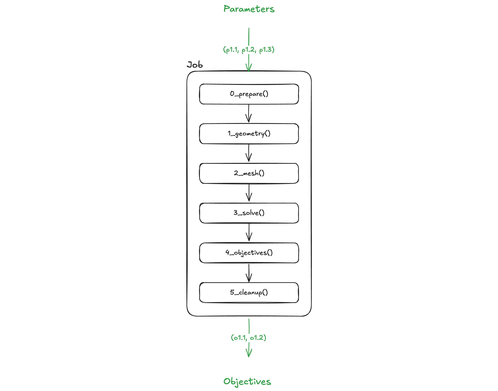
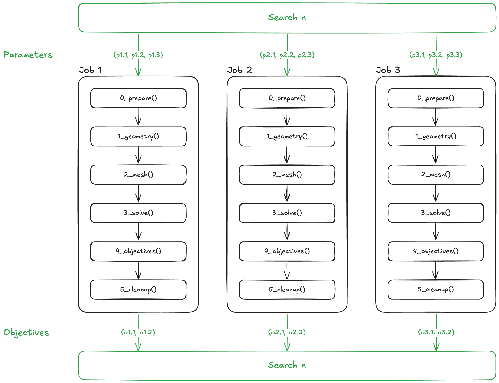

# Summary

The engineering design process increasingly relies on Computational Fluid Dynamics (CFD) thanks to the growing availability of affordable computational power and a multitude of discipline specific software. Leveraging CFD in preliminary design has the potential to reduce development costs and rapidly improve designs. The CFD process involves four major steps: geometry generation, meshing, solving, and post-processing. Conducting design optimization using CFD requires complete repetition of most or all of these steps for every design iteration which can slow development.

OpenPFO (Open Parametric Flow Optimizer) is a python workflow that integrates these four steps automating repetitive work and integrates design optimization using the pymoo optimization library [@pymoo]. The workflow can integrate any combination of open source software for each step with preexisting integration with FreeCAD [@FreeCAD], OpenVSP [@mcdonald2015interactive], OpenFOAM [@weller1998tensorial], and Paraview [@AhrensGL05]. OpenPFO is a tool that is capable of accepting parameter ranges, optimization objectives, a parameterized geometry model, and a simulation case, and then iterating through the design space to identify optimized results.

# Statement of need

OpenPFO was developed to conduct CFD based design space exploration and optimization by interconnecting the four main steps of CFD analysis: geometry generation, meshing, solving, and post processing in a loop with an optimization algorithm. This workflow replaces an inefficient process where a design engineer must manually iterate through these four steps for many different design variations. This approach can be very time consuming and is a significant barrier to CFD informed design optimization. OpenPFO streamlines this process by eliminating repetitive steps and guesswork, allowing engineers to focus on wider design space exploration and optimization.

# State of the field

Current solutions that integrate the four steps of the CFD process include software owned by leading simulation industry companies such as Siemens HEEDs and ANSYS’s CAESES, as well as independent solutions compatible with multiple CFD software including Luminary Cloud or Shaper.

There are multiple issues with these existing solutions, primarily their closed source nature and cost of subscriptions. They also typically have proprietary solvers and meshing software that limit simulation control, involve lengthy setup processes, or have poor integration across modules that makes automation difficult [@CAESES],[@HEEDS]. In addition, startups or academic projects that work with government restricted design data may be unable to use existing solutions for data security or regulatory concerns. Any project handling US-origin ITAR-classified data must seek permission before exporting this data to another country, making many industry standard software unsuitable for use [@GOC].

As an open-source tool that has been developed with problem extensibility in mind, OpenPFO provides a solution to automating the CFD process in a free, open access manner, while also allowing scalability on local, cluster, and cloud computing systems. 


# Software design

OpenPFO is an opinionated workflow designed for CFD-based design space exploration and optimization. Four main abstractions are provided: (1) Jobs, (2) Searches, (3) Problem, (4) Algorithm.

Each "Job" represents one combination of parameters, otherwise known as a geometry variation. Jobs implement 6 different user-defined functions called steps: `1_prepare`, `2_geometry`, `3_mesh`, `4_solve`, `5_objectives`, `cleanup`. Each step allows the user to programmatically define their automated steps, performing computations, interfacing with external tools, or submitting batch jobs to a scheduler.



Each user-defined function has explicit comments indicating where a user's programmatic logic should be placed. An example of this is the geometry function:

```python
# classes
from classes.functions import GeometryParameters, GeometryReturn


def geometry(
    geometry_parameters: GeometryParameters,
) -> GeometryReturn:
    """
    This function is used to generate the geometry for each point in the design space.
    """

    job_directory = geometry_parameters.job_directory
    processors_per_job = geometry_parameters.processors_per_job
    job_id = geometry_parameters.job_id
    logger = geometry_parameters.logger
    point = geometry_parameters.point
    meta = geometry_parameters.meta

    """ ======================= YOUR CODE BELOW HERE ======================= """

    GEOMETRY_RETURN = GeometryReturn(run_ok=True)

    """ ======================= YOUR CODE ABOVE HERE ======================= """

    return GEOMETRY_RETURN
```
Jobs handle exceptions for the user, preventing errors from interrupting the workflow. Users may define programmatic step validation, allowing the job to be terminated early should there be validation errors. 


Each "Search" constructs and executes jobs for a set of design points. "Searches" can execute jobs sequentially or in parallel. Often in HPC environments, parallel job execution is desired due to the abundance of compute capacity. Parallel jobs are facilitated by a thread pool executor which can be configured to run with a desired number of parallel job workers.



The "Problem" is a custom class inherited from pymoo's Problem class, importing the parameter definitions provided in the OpenPFO configuration. The "Algorithm" is a user-defined function `A_algorithm` which allows the user to define the pymoo algorithm and termination criteria.


OpenPFO was designed as an editable workflow and is installed and executed in editable mode rather than a distributable package. This was an intentional choice that was made to ensure users could understand and get started with OpenPFO as fast as possible. Editable mode also allows users to make quick changes to their user-defined functions without rebuilding to execute commands through the command-line interface.

Typically, numerical values are not enough for the outputs to have any significant value. Therefore, a built-in web application called the report-viewer is also provided to visualize results and aid the user to accurately interpret optimization data produced by OpenPFO.


# Research impact statement

OpenPFO has been developed with the intention of improving the flow of the engineering design process. This is achieved by enabling CFD based design optimization to be conducted with ease when used by researchers, industry professionals, and student design teams. OpenPFO has been developed using a simplified delta wing aerosurface simulation, chosen for its applicability to the WatArrow student design team at the University of Waterloo. This delta wing simulation case, when optimized with OpenPFO demonstrated the workflow's effectiveness when used for design optimization by accelerating the design process for the team. This adds credibility to its usefulness in industry where design issues may be addressed in a similar manner. 

Along with the delta wing case, a secondary example case of a hypersonic Busemann intake optimization was developed and used to validate the workflow extensibility. The extension of the OpenPFO workflow to this new type of problem reveals the versatility of the software and its potential impact in the research community. It provides an opportunity to research complicated topics, and the ability to focus on key relevant issues in engineering design and research by automating the four steps of CFD simulation into one for any design problem featuring fluid interactions currently able to be addressed using open source tools.


# AI usage disclosure

No generative AI tools were used in the development of this software, the writing of this manuscript, or the preparation of supporting materials.

# Acknowledgements

We would like to acknowledge the support and guidance provided by our advisors, Dr. Jean-Pierre Hickey (University of Waterloo's MPI Lab) and Dr. Jimmy-John Hoste (Destinus Aerospace). 

The development and validation of OpenPFO was conducted with technical and user input from the University of Waterloo's WatArrow Student Design Team. 

This research was enabled in part by support provided by SHARCNET (https://www.sharcnet.ca/my) and the Digital Research Alliance of Canada (alliance​can​.ca)

# References
